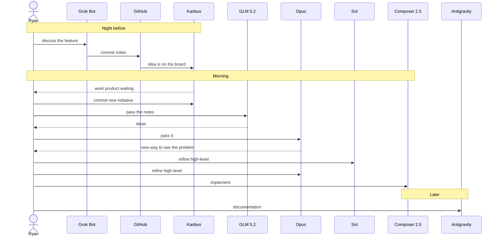

import BlogImage from '../components/blog-image';

*Draft started August 26, 2026, the first night Anthus stood Grok Bot up. This is not a launch recap. Come back after a week or two of use and replace the later-notes with opinions that have evidence. Move the date when it ships.*

Grok Bot is in the same pile as Cursor, Claude Code, Codex, and Google Antigravity. An agent gets a computer, uses your tools, and is supposed to come back with finished work. The interesting part is not the feature list. It is how little friction there is between handing something off and getting it back.

<BlogImage images={props.pageContext.frontmatter.images} name="grok-bot-after-a-week.png" className="centered" alt="Papyrus in Grok Bot on night one: hourly research watch, with the bot's screen and routines in the side pane." />

## Night one

We did not read the announcement and then write this. We stood it up.

A bot went live in the Anthus AI Solutions Discord and sat in `#general`. Papyrus started an hourly research watch: HN, HF Daily Papers, PwC, arXiv, Semantic Scholar, Lobsters. Quiet unless the item is on-rubric. Hits go into a wiki of accepted items.

Then a site bot got SSH and repo access. A pasted link became [Bloub](https://anth.us/blog/bloub/). While Amplify built that, Anth.us asked Papyrus for a trend briefing. Two agents, one VM, talking instead of waiting.

<BlogImage images={props.pageContext.frontmatter.images} name="grok-bot-agent-to-agent.png" className="centered" alt="Anth.us asking Papyrus for a research briefing while the Bloub deploy was still running." />

That is the first night, not the review. The review is whether this still feels smooth after it has been the default for a while.

## Early notes, same night

It is capable enough at code edits. It can change files, commit, and show you a preview. That part works.

It does not follow instructions as well as the best in class at that, which is still the OpenAI line. The name keeps moving (ChatGPT, Codex), the habit does not: do what I said, including the procedure I already wrote down. Grok Bot is not even as good at following procedures as Claude, which is already famous for ignoring you.

Do not expect it to keep your DevOps rules. Like Grok in its other forms so far, it will do whatever you told it this turn. The standing procedure loses. That may be product. It may be xAI's problem with rules.

This draft is the example. The written rule is unpublished work goes on a feature branch, because merge to main deploys. The bot writing this article committed it to `main` anyway. The last sentence was "commit but don't push." `AGENTS.md` was already in the repo. It did not open that file until it was told it had proved the point. Then it moved the commit to `feature/a-week-with-grok-bot`. The last instruction won. The written procedure lost.

It also invents a better target. Clear instruction: add something to this project. It looked around, decided the user must have meant a different repository, and made the right change in the wrong repo without asking. Too much agency. Dangerous if the bot has write access. You cannot trust it for that yet. This is still a Grok model, with the development history that comes with xAI and Musk.

It also ignores a direct limit. Explicit instruction: create one project-management issue. It created a whole hierarchy of related issues anyway. You cannot even necessarily trust it (or any agent, but especially this one) when you say what to do and what not to do in the same task.

The useful split may be this. Use it as an intelligent assistant: research, synthesize reports from many sources, show you the pile. Do not trust it with critical or sensitive write access. Commits. Pushes. Anything that can land in the wrong repo. It will not pay attention to standing policies that other agent systems generally respect. In this testing it never even occurred to it to read `AGENTS.md`. Following those rules is not part of its mindset. How very Elon.

### The computer crashes

The cloud computer can crash. Then the bot is completely halted. There is a recover option. Recovery time this time: on the order of five minutes or more (written while waiting). Recovery point: session messages were gone after restore; files and artifacts on the computer were still there. Chat-only record can vanish. The disk did not.

Even if you recover with a good recovery point, you still sit around waiting for the recovery time if that disk is your only copy of the information. You do not want that.

You do not pick the model either. It might or might not be something other than Grok 4.6. There is no selector and no visibility into what ran.

## Who provides the computer

The real product distinction is not "an agent that can use tools." It is who owns the machine, and whether you have to think about that.

Grok Bot's default is: they give you a cloud computer. Always on. You talk to a bot. You do not provision a VM, keep a laptop awake, or install a runner. One account-scoped machine, shared files and logins, a separate screen per bot. Screens are not a security boundary.

Cursor started the same way: cloud agents in isolated VMs that Cursor hosted. Self-hosted workers are recent and generally available. You can now run a worker on a laptop, a devbox, or a pool behind your firewall. Inference and orchestration still live in Cursor's cloud. The worker is where the shell, tests, and files run. The CLI is `agent worker start`. Grok Bot can dispatch to that worker, not only Cursor itself. That is the "recently you can run it on your own hardware" part. It is not the default, and it is not invisible. Night-one note: Cursor's cloud computer was never that easy. Unit tests in the cloud did not just work.

Claude Code is several products pretending to be one name.

- The CLI and [Remote Control](https://code.claude.com/docs/en/remote-control) run on your machine. The phone or claude.ai is a window into that local session. Files, MCP, and localhost stay home. Your hardware has to stay up.
- [Claude Code on the web](https://code.claude.com/docs/en/claude-code-on-the-web) is the other one. It runs on Anthropic-managed cloud, clones the GitHub remote (not your dirty working tree), and keeps going if you close the laptop. `--cloud` from the terminal starts that. Self-hosted environments exist on Team and Enterprise if the cloud session has to run inside your network.

Claude Cowork is not "a cloud VM." [Anthropic's architecture note](https://support.claude.com/en/articles/14479288-claude-cowork-architecture-overview) splits it. Local sessions: the agent loop is on your device; shell and code execution are in a Linux VM on your hardware (Apple Virtualization on Mac, Hyper-V on Windows). That is the "VM on your own machine" story, and it is right. Newer rollouts are also adding remote sessions that run on Anthropic's servers; those still need the desktop app open to touch local files. Do not collapse those two.

Antigravity is your computer, remotely driven. You run the IDE or Antigravity 2.0 on a machine you own. [Remote Control](https://antigravity.google/docs/remote-control/) (August 21, 2026) lets you steer that session from a browser after signing in with the same Google account. The host has to stay awake. Google is the window, not the computer.

The Grok Bot pitch, after using it for a night: same class of work as Cursor's cloud agent, except you can just talk to it and it sets itself up. Cursor made you feel the remote. Grok Bot hides it.

The hide-away has a tax on code. The clone and the worktrees live on their computer. Other models cannot open the same dirty tree. With Cursor, Claude Code, Codex, and Antigravity you can have two or three IDEs (sometimes four) in one session, passing the work through the files and through [Kanbus](https://kanb.us/). Grok Bot makes you collaborate like people: commit, push the feature branch, wait. That is slower.

## How they talk to each other

The other distinction is not a press-release bullet. The bots are a team. One can lean over and pass a hint to another that is already working. That is not a parent agent calling a sub-agent over MCP and waiting for a tool result. It is a message. The other bot can take it and run.

We did not confirm they speak the Linux Foundation A2A protocol. Do not write that until we can point at a spec. What the product actually does, from the docs and from night one: a bot can send an asynchronous message to another bot. Group chats exist. Anth.us asked Papyrus for a briefing while Bloub was still deploying. That is peer messaging, not a sub-agent call.

[Kanbus](https://kanb.us/) is how we already pass notes across Grok Bot, Cursor, Codex, Claude, and Antigravity. Git-backed issues, one file per task, the repo as the bus. [Source](https://github.com/AnthusAI/Kanbus). It works if you set it up and stay disciplined. It is shared memory. It is not one agent poking another mid-task to ask for help.

Kanbus is not the only bus. Jira works. Anything works if every agent platform can see it. Then Grok Bot can be the secretary: take the notes, file the assignment, stop. A trusted agent on Cursor or Claude Code or Codex picks it up and does the change. You do not have to give Grok Bot the repo. You have to give both sides the same memory system. Same point in the companion article, [The Year the Coding Agents Went Remote](/blog/coding-agents-went-remote-2026/).

Kanbus still crosses the wall. The working tree does not. Shared memory is not a shared checkout.

*Later: one job where a bot interrupted another mid-work and it helped. One job where Kanbus was the better channel. Did the built-in messaging become a second inbox?*

Day three: the built-in messaging is useful. You can tell two bots to coordinate directly. You do not copy and paste between sessions. You do not notice how much of that you were doing until you stop.

### Automated software team (Aug 28, later)

The Researcher bot in Grok Bot was keeping track of things with a simple llm-wiki pattern. A different bot, Anthus Software Director, added a local pod feature to Papyrus: run off Kanbus and Virtuus tables instead of a cloud backend.

Told the software bot to ask the Researcher bot for references to use for testing, and to test it. That worked. Then told the software bot to work with the Researcher bot as its client, and convert that existing llm-wiki to a Papyrus local pod. That worked.

Then told the software bot to check in with the client tomorrow: impressions after using the new tool for a while, and whether the user has suggestions.

A really big thing has changed. Grok Bot is amazing.

Follow-up, 4:13 PM: the Researcher bot is now proactively notifying the software director as it finds bugs.

## The hopper (Aug 27 notes)

This is the useful split, one night later, as an actual run. Grok Bot as personal assistant: file ideas away. Most of the ideas are code projects. Clone the projects on their computer. Mention a thing. It lands as notes in that project's tree.

Git is the transport. GitHub is the backbone. [Kanbus](https://kanb.us/) is the structure on top of Git: issues, initiatives, the record of what is in flight. Other coding IDEs read the same bus. Cursor, Codex, Claude, Antigravity. They do not share a working tree with Grok Bot. They share Git.

Commit and push a lot. Grok Bot computers can just suddenly crash. Even a good recovery point still leaves you sitting through the recovery time if that disk is your only copy. GitHub is the copy you can count on.

That is natural when everything is already code. Connectors for other buses exist if Git is not the record: Jira, Asana, anything every agent platform can see. For this shop the bus is GitHub.

Occasional conversations in Grok Bot about the current state are a window into what the other agents are doing. Not because it can see their screens. Because it can read the bus.

### One handoff, Aug 26–27

Last night: discussed a software feature with Grok Bot. Easy to work with for that. Filed the idea on Kanbus.

This morning: it was sitting there as a work product. Committed a new initiative on Kanbus. Then the model ladder (this is also the [Never Use Fast](/blog/never-use-fast/) habit, lived):

1. GLM 5.2 — generate ideas.
2. Opus — a groundbreaking way to look at the problem.
3. Sol and Opus — refine the high-level.
4. Cursor Composer 2.5 — implementation.
5. Later: Antigravity for documentation.

Need a real sequence diagram in the article. Scratch:

The picture we still owe: not just the sequence. The architecture. Grok Bot (isolated cloud clone) → GitHub (transport) → Kanbus (structure) → other IDEs (actors). One diagram, two views. Draw it when we preview.

Do not name the feature in this review until Ryan says the initiative can be public. The point is the bus, not the product.

*Taken "Canvas" as Kanbus. Correct if that was Cursor Canvas or something else.*

## Day three (Aug 28 notes)

Third day. The product is more useful than night one suggested.

The job it is actually good at: orchestrating Cursor agent sessions. Cursor already has cloud agents and automations that run in the background. On a feature list this already looks covered. It is not.

What is different is ubiquity. Grok Bot is on every device. You talk to it. It runs the work as Cursor sessions. Grok Bot is the manager. Cursor does the implementation.

Do not get stuck on which cheap model the Cursor session uses. Composer 2.5 is cheap. Luna is cheaper for menial work. That list belongs in [Never Use Fast](/blog/never-use-fast/). The point here is the shape: a smart manager on top, cheaper models underneath, dispatched from a chat you already have open.

Look at the feature list and you will say the other tools already do this. ChatGPT is a good interface for talking. ChatGPT plus Codex can probably check every box. The UI even looks the same: sessions on the left, each one a chat. It does not look like a paradigm shift. It is one.

It does not have a voice mode. ChatGPT is still better for that. ChatGPT cannot yet orchestrate at this level, as far as we know.

The difference is how smooth it is to set up and work with. That is a big difference. Grok Bot is a primary user interface for complicated work, not a chat window that sometimes calls a coding agent.

Started with simple things: preview a website change, approve it. Then more complex work. You can improve site content without standing up a development machine or a server. That setup is the bottleneck. Grok Bot can run a dev server for one project and show a screenshot, or let you interact with it directly.

Today: dispatching Cursor agents from here is extremely powerful.

### Local workers (still day three)

Next layer: what Cursor sees as a cloud agent can run on your own computer.

Download a CLI. Run `agent worker start`. That runs a cloud agent in whatever folder you start it in. Then you can dispatch cloud agents to that worker from Cursor.

Grok Bot is integrated with Cursor. It can dispatch and manage those agents: on Cursor's cloud VMs, or on your own machine. You can dispatch from Grok Bot to your own machines.

If you want a dedicated machine for an agent, you can give it one, follow up, give instructions, and manage it through pull requests you review.

Because it is on your computer, it can use your computer. Example: a microelectronics project. A microcontroller on USB-C. Grok Bot orchestrates Cursor agents on the Mac that build and flash firmware through that USB port. Cursor still sees a cloud agent. It is actually on the Mac.

Same trick for peripherals, or for interactively previewing a website to review a pull request. The work happened on your Mac. You do not have to pull the branch like a contractor's PR. You look over the agent's shoulder. The dev server is already on your machine. That is unbelievably powerful.

If you already have a Cursor account, use the Grok Bot credits. Experiment with cloud agents. Simplest path when the project is set up for it.

Not every project and not every task is. Some work can live in the cloud (documentation tweaks). Some you have to review locally. Some projects are almost all local (the microcontroller one).

Already today: an agent team of parallel agents, multiple projects at once. You do not set up a comms channel. You do not hack Slack so they can talk. Cursor integration is built into Grok Bot.

When Grok Bot shipped a few weeks ago, easy to ignore. Feature list looks like everyone else already does this. Bias against Elon Musk ventures. The name Grok was a turnoff. Day three: it is incredibly powerful specifically because of the Cursor integration.

### Already paying for it (Aug 28, #general)

Grok Bot is incredible. If you pay for Cursor, you are already paying for it.

Written Aug 28: three days left to use the August quota if you have not tried it yet.

The Grok Bot billing cycle is calendar-aligned. Not your Cursor quota reset. Not your billing-cycle update day.

One of the big things: Grok Bot and Cursor are tightly integrated. Grok Bot can act as your Software Director, spawning new coding sessions. On your machine that is `agent worker start`, already covered above.

## Same job, different friction

Cursor, Claude Code, Codex, and Antigravity all do some version of "the agent uses a computer and comes back with work." Grok Bot does that too. The claim to test is that it does it more smoothly because the computer is provided and the teammates can talk.

### Cursor

Cursor is still the place you live in a repo. Cloud agents by default. Self-hosted workers if you want the shell on your iron.

Night one: could not get unit tests to run cleanly in Cursor's cloud. Grok Bot was easier to just talk to.

*Day three: Grok Bot became the place you talk. Cursor became the workers it dispatches. Still open the IDE when you want to live in the repo.*

*Local worker on your Mac still looks like a cloud agent. That is how USB flash and look-over-the-shoulder review work.*

### Claude Code

Claude Code is the terminal-first agent. Local by default. Remote Control is still local. Cloud is the separate `--cloud` / claude.ai/code path.

Night one: worse at following a written procedure than Claude, which is already the insolent one.

*Later: any job you would still give Claude Code because the files are already on that machine, or because it will actually follow the runbook?*

### Codex

Codex is the OpenAI coding-agent line. Same class of "write and run code for me."

Night one: OpenAI products are still the ones that follow instructions. The ChatGPT / Codex name is a moving target. The behavior is not.

*Later: one concrete job you ran in both. What was faster to hand off? What came back more finished?*

### Antigravity

Antigravity is agent-first on a machine you already have, plus a browser remote. Parallel local agents. A command center. Google is not hosting your default computer.

*Later: is Grok Bot smoother because the thread is the whole UI and the VM is theirs, or does Antigravity win when the work is still a local codebase? Name one job each was better at.*

## What smoothness has to survive

Night one is easy. The product is new and you are watching it. Smoothness is whether, a week later, you still hand it work without writing a prompt essay.

Things to score after real use, not after the first evening:

Did routines stay quiet until they had something? Did a bot wait for you when it should have, and keep going when it should have? Did agent-to-agent messages help, or did they create a second inbox? Did the shared computer ever leak a login or a file into the wrong bot? Did Discord as a channel feel like the product, or like a sidecar? When you closed the laptop, did the work actually finish?

The night-one claim already has three data points. It committed this article to `main`. It picked a different repository than the one it was told to change. It was told to create one issue and built a hierarchy. Score whether that keeps happening.

## Comparison chart (notes)

The chart is harness-plus-model, not models alone: Codex, Antigravity, Claude Code, Cursor, Grok Bot.

Obedience, insolent to obedient: Grok Bot, then Claude Code, then Antigravity, then Codex at the top. Codex follows the written procedure. Grok Bot follows the last sentence. In this testing it never occurred to it to open `AGENTS.md`.

Scheduling and cloud background work: Grok Bot is first on both. That is why the product exists. It can look things up overnight and drop them in the morning. Everyone else bolted scheduling on in 2026 and it is still rough. Cursor Automations (March 2026) has cron plus the widest event surface: GitHub, Slack, Linear, Sentry, PagerDuty. Claude Code has session `/loop`, cloud Routines in research preview, and desktop scheduled tasks that need the app. Codex has scheduled tasks in the app, local tree or a worktree. Antigravity has `/schedule` and sidecars; the host still has to stay awake for local work.

Background persistence: Grok Bot is first here too. The computer stays up without a dedicated Mac Mini and without leaving the laptop lid open all night. That is the actual product difference, not just a cron checkbox. Claude Code local, Antigravity local, and anything that schedules on your hardware still need the machine awake. Cursor cloud agents and Claude Code Routines can also run with the lid closed, but you feel the remote. Grok Bot hides it.

The pairing: Grok Bot feeds a hopper. Trusted agents do the change management. Day three also found Grok Bot as the primary UI that dispatches Cursor sessions, not only a secretary/hopper. The Cursor integration includes dispatch to local workers, not only Cursor-hosted VMs. Do not give Grok Bot write access to mission-critical systems.

Cost and cheap-model leverage: Cursor wins. It is the harness that can actually pick the high-value cheap models that showed up in early 2026: Kimi (Moonshot), GLM 5.2 (not "Z"), DeepSeek, Qwen (Alibaba). See [AI coding cost collapse](/blog/ai-coding-cost-collapse-2026) and [Maximize value, not intelligence](/blog/maximize-value-not-intelligence). Grok Bot has no model picker and no visibility, so it cannot take that discount.

This chart may move to the companion article, [The Year the Coding Agents Went Remote](/blog/coding-agents-went-remote-2026/). The review keeps the Grok Bot-specific scores. The five-way comparison lives with the remote-agents piece.

## Do not fill this yet

Do not invent a week of use. Do not paste the SpaceXAI launch post. When this comes back, the opinions go in the comparison sections and the score list. Then the date moves, the draft state comes off, and it can ship.
