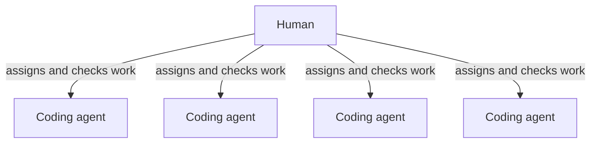
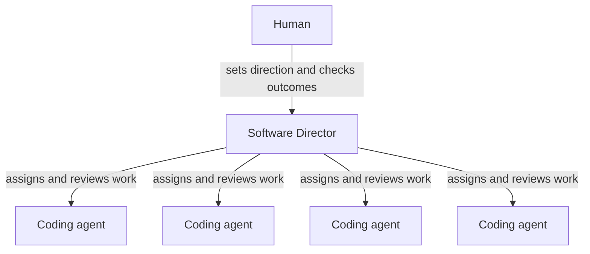

import BlogImage from "../components/blog-image"

<BlogImage
  images={props.pageContext.frontmatter.images}
  name="from-pair-programmer-to-executive.png"
  className="centered"
  alt="From pair programmer to executive."
/>

Four months ago, I wrote about the moment coding agents stopped feeling like pair programmers and started feeling like contractors. Instead of sitting in one conversation and working through one problem together, I could write down several pieces of work and let several agents take them at once.

That created an obvious problem: I was still everybody's manager.

Every agent could write code quickly, but every assignment, clarification, result, and next decision still passed through me. Opening more sessions increased the amount of work in flight. It did not increase my ability to follow all of it.

In [Cybernetic Development](/blog/cybernetic-development/), I described how a shared project-management system helped. Agents could take work from a durable record instead of waiting for me to carry instructions between conversations. At the time, that felt like the organizational breakthrough.

It was only half of one.

I had given the agents a place to report. I had not given them a manager.

## Kanbus organized the work

Kanbus is the project-management system I use for software and editorial work. On a Kanbus project, each task, bug, user story, or other piece of work gets its own card. A person or agent can claim the work, record what happened, update its status, and leave evidence for whoever comes next.

That shared record matters. A coding session hidden in one tab is useful only to whoever remembers that tab. A Kanbus issue survives across applications, computers, models, and days. Everyone involved can see what is waiting, what is in progress, and what has already been tried.

But Kanbus organized the work; it did not manage it.

It did not read the code and form an opinion. It did not decide that a test result was inadequate, reject a change because the documentation was missing, or determine which specialist should take the next step. Those decisions still belonged to me.

For me, more than three or four active agent conversations became confusing. That is not a universal management limit. It is what happened when I tried to remember which tab in Codex, Claude Code, Cursor, or another application belonged to which project; which sessions were local or in the cloud; and which agent was waiting for information from another agent on another computer.

The answer was not a faster model. It was management.

## Management begins when software can say no

A manager agent is different from a task queue. It can receive a request, divide it into workstreams, assign those workstreams to coding agents, inspect what they return, reject work that does not meet the requirements, combine accepted changes, and return the result to the original requester for checking.

The important verb is _reject_.

Software that accepts every result is a router. A Software Director that sends work back because the tests are incomplete, the coverage fell, or the documentation is missing is doing something closer to supervision. It is applying judgment within a procedure.

I designed roles such as Software Director, Researcher, and Publicist. Early on, I sometimes explicitly told one role to consult another. Over time, the agents began using those responsibilities without me specifying every handoff. The roles were designed; some of the collaboration that grew from them was not.

The firsthand story of watching that happen belongs in my [Grok Bot review](/blog/a-week-with-grok-bot/). The broader point does not depend on Grok Bot. Once an agent can supervise other agents, the basic unit of AI-assisted work is no longer one conversation. It can be an organization.

## The org chart changes the work

Here is the same number of coding agents arranged in two different ways.

### Before: four direct agent conversations

### After: one supervised software team

Nothing magical happened to the workers in the second diagram. The change is who must remain inside every operational exchange.

The human still decides what matters. The human defines the roles, boundaries, and acceptance requirements. The human remains responsible for the consequences. But the human no longer has to notice that a test suite finished, return to the correct tab, interpret the result, decide on the next iteration, and restart the work every time.

That attention gap is larger than it sounds. Some agent efforts run for hours. Many results return within a few minutes, and larger tasks often take 20 or 30 minutes depending on the test suite. When a human operates the loop, completed work waits until the human notices and has attention available. A manager agent can make the next decision as soon as the evidence appears.

## Review may be the most valuable job

We already have automated checks. CodeQL looks for security vulnerabilities. Snyk examines dependencies and code for known problems. Dependabot tracks vulnerable or outdated packages. Test suites tell us whether documented behavior still works.

Those checks are necessary, but they do not replace a careful review procedure. Someone still has to ask whether the tests cover the new behavior, whether code coverage moved in the wrong direction, whether the documentation matches the change, and whether the implementation solved the problem that was actually assigned.

Smart coding agents can be remarkably good at reviewing code written by other coding agents. In some circumstances, they can be more thorough than a human who is excited about a feature and wants to deploy it. That does not make the human unnecessary. It gives the review process a participant with one job, a written checklist, and no urge to declare victory at 5:30 on Friday.

A good manager agent is not trusted because it sounds confident. It is trusted to the extent that it follows a solid procedure and produces evidence at each gate.

## Two 2026 trends met here

Agent management became practical because two changes arrived together.

First, coding agents became much better at long-running work. They can continue through tests, review, corrections, and another attempt instead of stopping after one code change and waiting for a human to push the button again. [The Year the Coding Agents Went Remote](/blog/coding-agents-went-remote-2026/) covers the infrastructure shift behind that change.

Second, high-quality coding became cheaper. In my own work, Composer 2.5 is inexpensive enough that I can keep a development farm working throughout the day and night without treating every model call as a budget decision. That is my current operating posture, not a promise about anybody else's plan or future pricing.

Either trend by itself is insufficient. Cheap agents that stop at every decision leave the human carrying every handoff. Long-running agents that cost too much remain impressive demonstrations. Cheap, capable, long-running agents make a persistent software organization practical.

This is where Jevons Paradox appears. When a useful resource becomes cheaper, we often consume much more of it. One coding session becomes four. Work that was not worth starting becomes worth attempting. A reviewer rereads the workers' output. Total AI usage can rise precisely because each unit became cheaper and useful in more places.

I call the resulting operating style “tokenmaxxing for fun and profit.” Tokens are units of paid AI usage; tokenmaxxing means keeping many inexpensive agents productively occupied and optimizing for useful work completed rather than minimizing every individual call. I wrote more about the economics in [The Year Coding Became a Commodity](/blog/ai-coding-cost-collapse-2026/), [Maximize Value, Not Intelligence](/blog/maximize-value-not-intelligence/), and [Never Use Fast](/blog/never-use-fast/).

The scarce resource is increasingly human attention: deciding what deserves work, defining what good looks like, and examining the outcomes that matter.

## This category is escaping the lab

OpenClaw is the most vivid earlier example of an always-available personal agent: powerful, flexible, difficult, and willing to operate close to the edge of what many people would consider comfortable. Its [own introduction](https://openclaw.ai/blog/introducing-openclaw) says it runs on the user's machine and acts through chat applications, while acknowledging that prompt injection remains a security problem.

The project's rapid sequence of names reads like a compressed history of the category: [Warelay](https://github.com/openclaw/openclaw/commit/16dfc1a5b929), [CLAWDIS or Clawdis](https://github.com/openclaw/openclaw/commit/a27ee2366ebfa366ee960e567f72f97fe63085d9), [Clawdbot](https://github.com/openclaw/openclaw/commit/246adaa1191438b9e9e178384a026b4c123782f1), [Moltbot](https://techcrunch.com/2026/01/27/everything-you-need-to-know-about-viral-personal-ai-assistant-clawdbot-now-moltbot/), and finally [OpenClaw](https://openclaw.ai/blog/introducing-openclaw). [“Clawd” was the assistant character](https://docs.openclaw.ai/start/lore), not another name for the runtime.

Now major platforms are absorbing the idea. Microsoft describes [Scout](https://www.microsoft.com/en-us/microsoft-365/blog/2026/06/02/introducing-microsoft-scout-your-always-on-personal-agent/) as an always-on system powered by OpenClaw, with governed access and human signoff. Google describes the next Gemini app, including [Gemini Spark](https://blog.google/innovation-and-ai/products/gemini-app/next-evolution-gemini-app/), as proactive and available around the clock.

These products are not equivalent, and they do not prove that any particular implementation is safe or mature. They show that persistent agents which act, coordinate, and return with results are becoming a product category rather than a hobbyist stunt.

## A confidently wrong manager is still wrong

The company metaphor is useful until it is not.

Agents do not have tenure, ambition, incentives, dissatisfaction, professional pride, or legal accountability. Calling one a Software Director does not grant it judgment by title. The name only helps define its responsibilities, tools, required evidence, and limits.

The risks compound through a hierarchy. A worker can return bad code. A manager can accept it. Summaries can distort information as they move between roles. A confident manager agent can direct several workers down the wrong path at once. There is no software equivalent of a human accountability chain when the result causes harm.

New arrangements need close monitoring while their roles, procedures, and guardrails are calibrated. Consequential decisions and final accountability still belong with a human. The goal is not autonomy at any cost. It is to spend human attention where judgment and responsibility actually matter.

## Reporting lines are becoming system design

There is an old observation in software engineering called Conway's Law: the structure of a system tends to reflect the communication structure of the organization that built it.

With agent teams, that relationship becomes something we can design directly in software. Who assigns work to whom? Who can reject it? What evidence must travel with a result? Who checks whether the integrated change solved the original problem? Which decisions require a human?

Those are organizational questions. They are also becoming engineering questions.

Prompts still matter. Tools still matter. Models still matter. But once several agents can work for long periods at low cost, the performance of the whole system depends just as much on reporting lines, shared records, acceptance procedures, and feedback. A brilliant worker inside a confused organization can create confusion faster. A good organization can make capable, inexpensive workers surprisingly effective.

The one-person software company has acquired middle management. That sounds ridiculous. A few months ago it would have felt ridiculous to me.

But the practical change is simple. I no longer have to operate every agent as a direct report. I can design who assigns work, who checks it, and where the human must step back in.

That is the shift: not from human control to machine control, and not from one magical model to an even more magical model. It is a shift from operating individual agents to designing an organization of agents—and deciding exactly where the human belongs.
